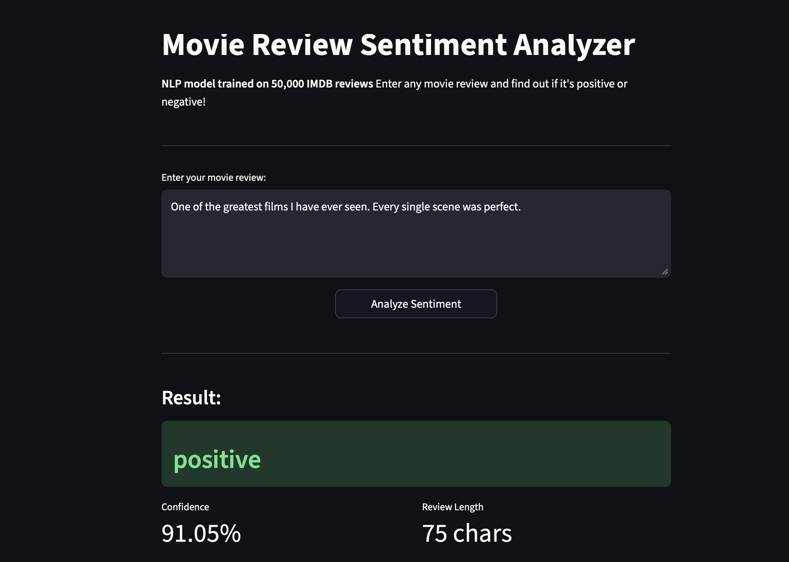
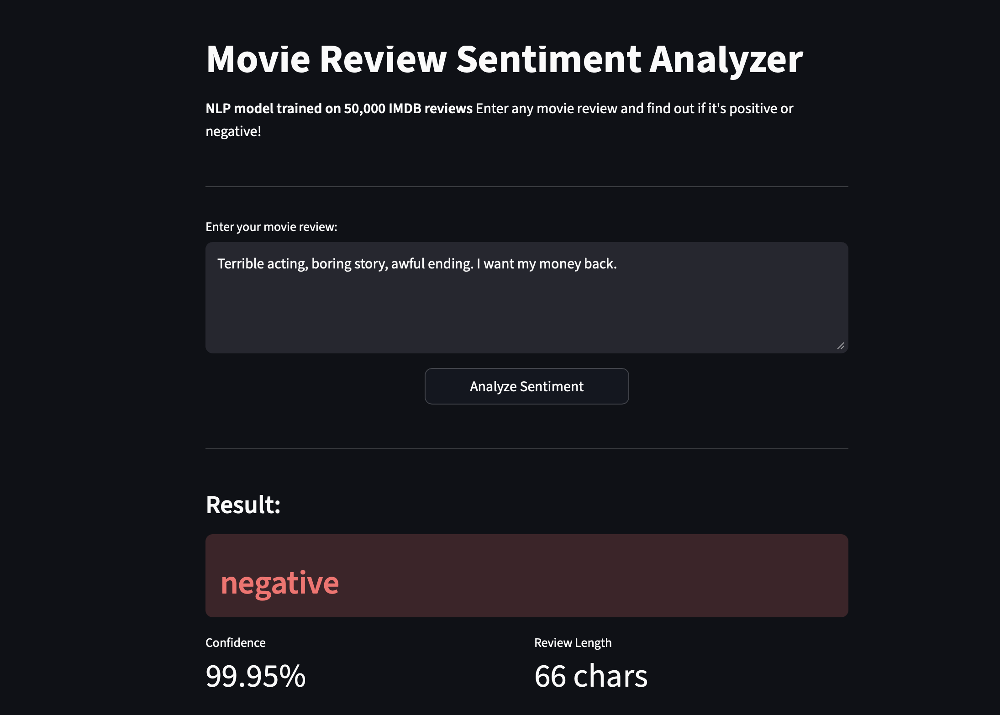
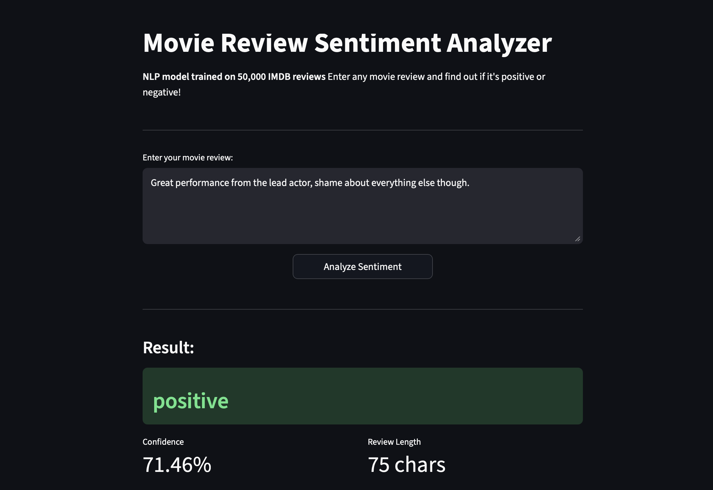
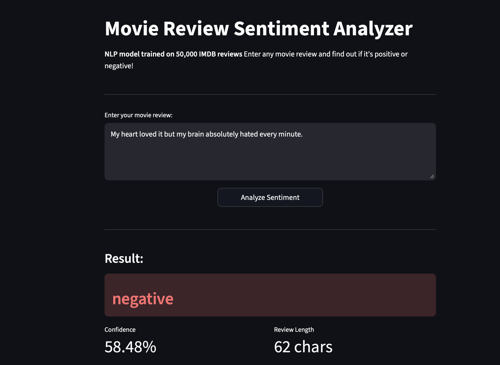
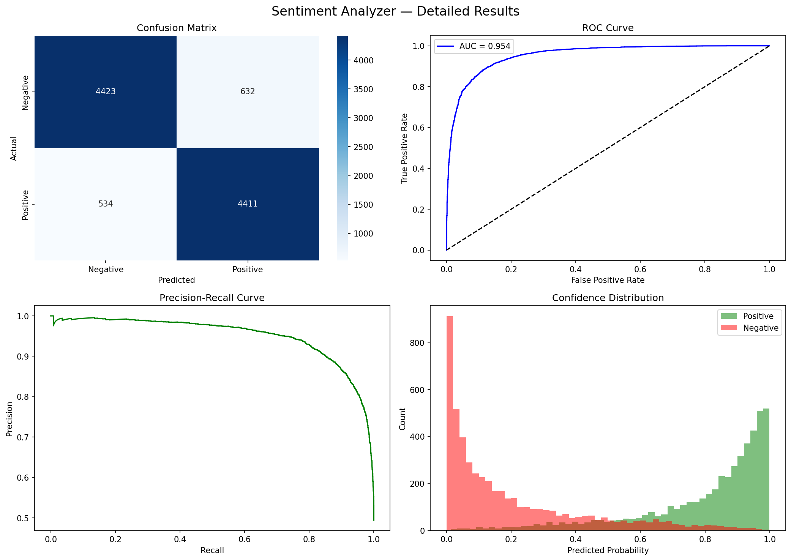

# Movie Review Sentiment Analyzer 🎬


A production-ready NLP system for binary sentiment classification of movie reviews.
Built with a complete ML pipeline — from raw data ingestion to model deployment —
following industry standards for code structure, reproducibility, and scalability.

Trained on 50,000 IMDB reviews using TF-IDF vectorization and Logistic Regression,
achieving 88% accuracy and 0.954 AUC. Deployed as a containerized web application
on Hugging Face Spaces with a REST API interface.

---

## Live Demo

👉 [Try it on Hugging Face](https://huggingface.co/spaces/faizzan/sentiment_analyzer)

---

## Screenshots

### Positive Review


### Negative Review


### Mixed Review


### Low Confidence Prediction


---

## Training Results



### Performance Summary

| Metric    | Score  |
|-----------|--------|
| Accuracy  | 88%    |
| AUC Score | 0.954  |
| Precision | 88%    |
| Recall    | 88%    |
| F1-Score  | 88%    |

The ROC-AUC of 0.954 reflects strong class separability. The confidence distribution
confirms the model assigns high-probability predictions to unambiguous reviews,
while appropriately reserving low-confidence outputs for semantically mixed inputs.

---

## Dataset

| Split    | Size   |
|----------|--------|
| Total    | 50,000 |
| Training | 40,000 |
| Testing  | 10,000 |
| Positive | 25,000 |
| Negative | 25,000 |

Sourced from the IMDB dataset via Hugging Face Datasets. Perfectly balanced across
both classes, eliminating the need for resampling or class-weight adjustment.

---

## Pipeline Overview

```
Raw Text
   ↓
Text Cleaning (lowercase, HTML removal, punctuation stripping, stopword removal, stemming)
   ↓
TF-IDF Vectorization (max_features=10,000, ngram_range=(1,3))
   ↓
Logistic Regression (max_iter=10000, random_state=42)
   ↓
Prediction + Confidence Score
```

---

## Architecture

```
sentiment_analyzer/
├── src/
│   ├── data/
│   │   ├── load_data.py        # data ingestion and caching
│   │   └── preprocess.py       # text normalization pipeline
│   ├── features/
│   │   └── build_features.py   # TF-IDF feature engineering
│   └── models/
│       ├── train.py            # model training and serialization
│       ├── evaluate.py         # evaluation metrics and reporting
│       └── predict.py          # inference with HF Hub fallback
├── assets/                     # screenshots and result charts
├── configs/
│   └── config.yaml             # centralized configuration
├── streamlit_app.py            # interactive web interface
├── app.py                      # FastAPI REST endpoint
├── main.py                     # end-to-end training pipeline
├── Dockerfile                  # optimized container build
└── requirements.txt
```

---

## Installation

**Clone the repository:**
```bash
git clone https://github.com/mhd-faizzan/sentiment_analyzer
cd sentiment_analyzer
pip install -r requirements.txt
```

**Run the training pipeline:**
```bash
python main.py
```

**Launch the web interface:**
```bash
streamlit run streamlit_app.py
```

**Start the REST API:**
```bash
uvicorn app:app --reload
```

**Run with Docker:**
```bash
docker pull faizzan/ml_sentiment_analyzer
docker run -p 8501:8501 faizzan/ml_sentiment_analyzer
```
Open http://localhost:8501

---

## API Reference

**Endpoint:** `POST /predict`

**Request:**
```bash
curl -X POST "http://localhost:8000/predict" \
-H "Content-Type: application/json" \
-d '{"review": "This movie was absolutely amazing!"}'
```

**Response:**
```json
{
  "review": "This movie was absolutely amazing!",
  "label": "positive",
  "confidence": "96.33%"
}
```

---

## Tech Stack

| Component | Technology |
|-----------|-----------|
| Language | Python 3.11 |
| ML Framework | Scikit-learn |
| NLP | NLTK |
| API | FastAPI |
| Web UI | Streamlit |
| Containerization | Docker |
| Model Registry | Hugging Face Hub |
| Deployment | Hugging Face Spaces |
| Version Control | Git + GitHub |

---

## Reproducibility

All experiments are fully reproducible. Random seeds are fixed across
`train_test_split`, model initialization, and feature extraction.
Trained artifacts are versioned and stored on Hugging Face Hub.

```python
random_state = 42  # used consistently across all pipeline stages
```

---

## Links

| Resource | URL |
|----------|-----|
| Live App | https://huggingface.co/spaces/faizzan/sentiment_analyzer |
| Model Registry | https://huggingface.co/faizzan |
| Docker Image | https://hub.docker.com/r/faizzan/ml_sentiment_analyzer |
| Source Code | https://github.com/mhd-faizzan/sentiment_analyzer |

---

Developed by [Muhammad Faizan](https://github.com/mhd-faizzan)